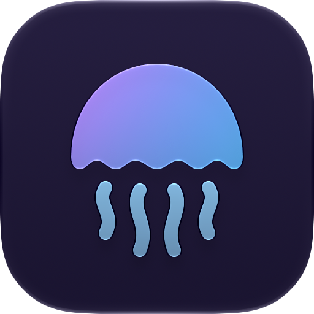

<p align="center">
  
</p>

<h1 align="center">Bloom</h1>

<p align="center">
  <a href="https://github.com/dantech2000/bloom/actions/workflows/ci.yml"></a>
  <a href="https://github.com/dantech2000/bloom/releases/latest"></a>
</p>

A native [Jellyfin](https://jellyfin.org) client for macOS, written in Rust. The
interface is drawn with [GPUI](https://www.gpui.rs/) and video plays inside the
window through an embedded [libmpv](https://mpv.io).

Bloom started as a fork of [jellyui](https://github.com/iamd3vil/jellyui) by
iamd3vil. The first four commits of this repository are that project's.

## What it does

- **Browse.** Home with Continue Watching, Next Up and recent items, libraries
  with sort and filter, series, seasons and episodes, collections, playlists,
  and a search with a local title index.
- **Play.** Direct play of the original file by default. Resume, chapters,
  preview images on the seek bar, intro and credit skip, audio and subtitle
  choice with a timing offset, playback speed, picture in picture, and frame
  pacing locked to the display.
- **Quality.** A Quality menu with a bitrate limit and server transcoding when
  you ask for it. Nothing lowers the quality unless you turn it on.
- **Watch together.** SyncPlay groups with other Jellyfin clients, with drift
  correction.
- **Play on another device.** Other Jellyfin sessions, Chromecast and AirPlay.
  Other clients can also control Bloom.
- **Offline.** Downloads with resume, and playback of downloaded files without
  the server.
- **Server dashboard** for administrators: users and their access, libraries,
  devices, activity, scheduled tasks, plugins and their settings, logs, API
  keys, and the server settings pages.
- **Your account.** Profile picture, password, Quick Connect, playback,
  subtitle, home and display settings.
- **Jellyfin Enhanced** features when the server has that plugin: quality tags,
  bookmarks, hidden content, requests through Jellyseerr.
- **macOS.** Media keys and the Now Playing tile, no display sleep during
  playback, and a layered app icon that follows the system's icon style.

## Requirements

| Dependency | Notes |
| --- | --- |
| macOS | The app has only been built and run on macOS |
| Rust 1.97.1 | Pinned in `rust-toolchain.toml`; `rustup` installs it on the first build |
| Xcode | For the Metal toolchain, `actool` for the app icon, and clang, swiftc and make for libmpv |
| Python 3, git | `dev/build-mpv` builds libmpv from source into `vendor/mpv`; meson, ninja, cmake and pkgconf go into a venv there |
| ffmpeg (optional) | The playback tests encode short clips with it |
| [just](https://github.com/casey/just) (optional) | Runs the recipes in `justfile` |

## Build and run

```sh
dev/build-mpv           # once: builds libmpv into vendor/mpv (about 5 minutes; the build folder is a cache)
cargo build --release
dev/run                 # starts the app with the debug channel on
```

At the first start, enter the address of your server and sign in, or use Quick
Connect. To get `Bloom.app`, run `dev/bundle`; `dev/install` builds it and
copies it to `/Applications`.

### Updates

A release build updates itself with [Sparkle](https://sparkle-project.org). It
reads a feed from the newest GitHub release, checks the signature of the
download, and asks before it installs.

A release is made by GitHub Actions: a commit `Release x.y.z` on `main`, one
command to start the workflow, and an approval before the update is signed.
[docs/RELEASING.md](docs/RELEASING.md) is the procedure, with the one-time
set-up of the signing key, the dry run and the roll-back. The notes of each
release are in [docs/releases](docs/releases).

A build with no public key, and a build started with `dev/run`, has no updater.

Servers, profiles, access tokens and downloads are in
`~/Library/Application Support/bloom`. Cached images are in
`~/Library/Caches/bloom`.

## Development

| Command | Purpose |
| --- | --- |
| `dev/test` | All tests |
| `dev/smoke` | Opens every page in a test instance and checks the frame cost |
| `dev/run-test` | A second, muted instance for tests, labelled "TEST INSTANCE" |
| `dev/jctl <command>` | Drives an instance through its debug socket (`dev/jctl state`) |
| `dev/shot <file>` | Captures the window of an instance |
| `dev/jctl perf`, `dev/jctl pacing` | Frame cost, and how evenly video frames reach the screen |

### Layout

| Path | Purpose |
| --- | --- |
| `src/app.rs` | The root view: session, navigation, player state |
| `src/views/` | Screens: sign-in, shell, home, library, detail, player |
| `src/player.rs`, `src/pacing.rs`, `src/video_surface.rs` | The libmpv worker, the render thread and display sync |
| `src/stream.rs`, `src/adaptive.rs` | Playback negotiation, quality, transcoding |
| `src/syncplay/` | SyncPlay: protocol, clock, drift control, session |
| `src/cast/`, `src/chromecast/`, `src/airplay/` | Playing on other devices |
| `src/downloads/` | Offline downloads |
| `src/admin/`, `src/settings/`, `src/metadata/` | Dashboard, user settings, metadata editor |
| `src/jellyfin.rs`, `src/realtime.rs` | REST client and the server socket |
| `src/ui/` | Components from the gpuicn registry, as editable source |
| `src/brand.rs` | The name of the app, in one place |
| `src/debug.rs` | The debug channel |
| `dev/` | Scripts |
| `vendor/gpui-pre-apple` | GPUI's macOS backend with two patches (backdrop blur, BGRA surfaces) |

## License

Bloom is free software under the
[GNU Affero General Public License v3.0 or later](LICENSE), as is jellyui.

Third-party parts keep their own licenses. [CREDITS.md](CREDITS.md) lists the
projects Bloom is made with, what each is used for, and its license. The same
list is in the app, in Settings > About.
